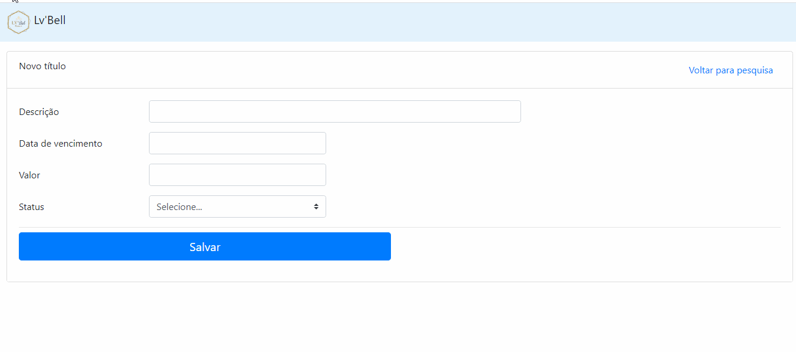
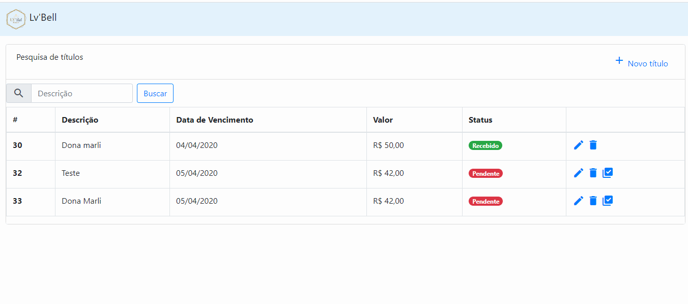

# Cobrança, gerencie sua cobrança de forma fácil e rápida

Cobrança é um sistema que permite gerenciar títulos de cobrança de forma fácil e rápidao, desenvolvido nos tempos livres com objetivo de fixar os conhecimento aprendido no Framework Spring MVC.

Tecnologias utilizada
-------------

* Java 1.8
* Spring Boot/JPA/Web(MVC)
* Template engine Thymeleaf
* jQuery e Bootstrap-4
* Database Mysql
* Maven

## Dependências

>As dependências foram selecionadas a partir do [Spring Initializr](https://start.spring.io/)

## Demo

Demonstração cadastro de título

---
Demonstração de consulta, delete e receber
